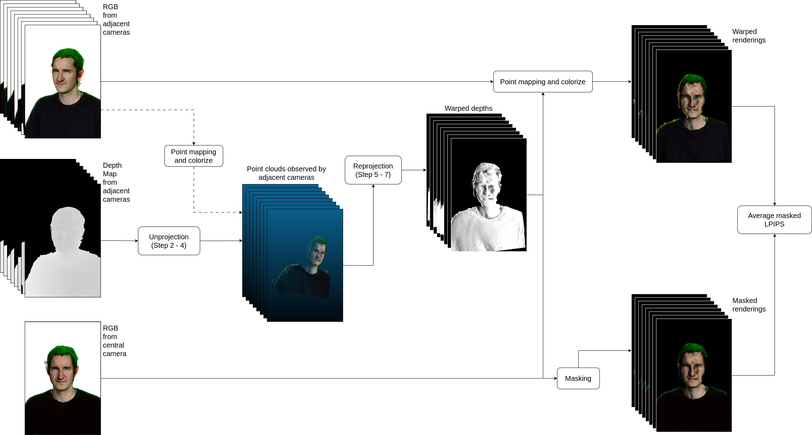
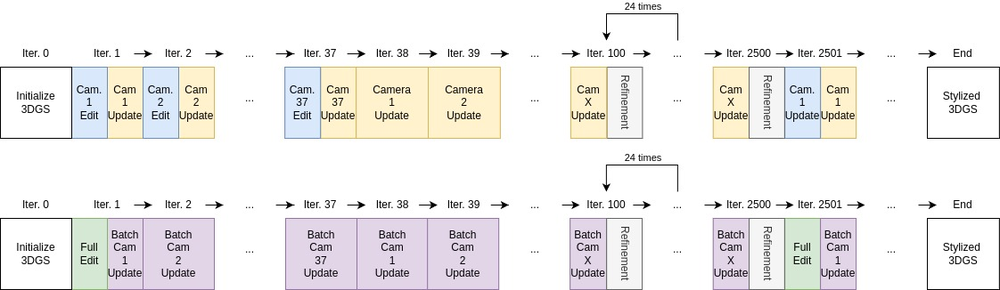
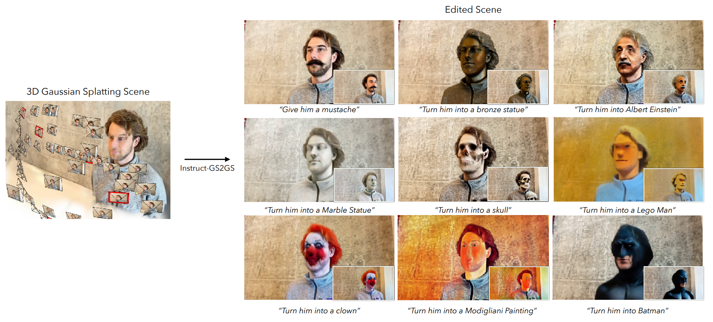
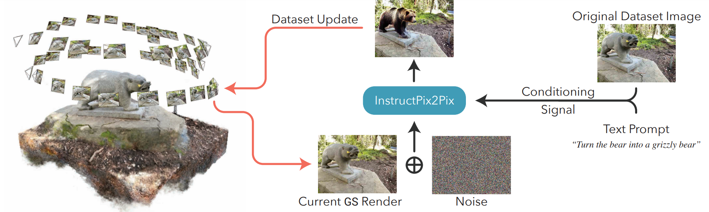

# Consistency Metrics for Text-Based Stylization in Multi-View Images of 3D Gaussian Splatting Head Avatars

This is fork of the [InstructGS2GS](https://github.com/cvachha/instruct-gs2gs) for the master thesis. This codebase modifies the original implementation for the purpose of experimentation.

- [Consistency Metrics for Text-Based Stylization in Multi-View Images of 3D Gaussian Splatting Head Avatars](#consistency-metrics-for-text-based-stylization-in-multi-view-images-of-3d-gaussian-splatting-head-avatars)
  - [About](#about)
  - [Modifications](#modifications)
    - [Stylization setting](#stylization-setting)
    - [Refinement settings](#refinement-settings)
    - [Editing schedules](#editing-schedules)
- [Instruct-GS2GS: Editing 3D Scenes with Instructions](#instruct-gs2gs-editing-3d-scenes-with-instructions)
  - [Installation](#installation)
    - [1. Install Nerfstudio dependencies](#1-install-nerfstudio-dependencies)
    - [2. Installing Instruct-GS2GS](#2-installing-instruct-gs2gs)
    - [3. Checking the install](#3-checking-the-install)
  - [Using Instruct-GS2GS](#using-instruct-gs2gs)
  - [Training Notes](#training-notes)
  - [Tips](#tips)
  - [Extending Instruct-GS2GS](#extending-instruct-gs2gs)
    - [Issues](#issues)
    - [Code structure](#code-structure)
  - [Bibtex](#bibtex)


## About



The main objective of this thesis was to explore suitable metrics for quantifying the multi-view consistency of a stylized human head avatar in 3D Gaussian Splatting. This objective was achieved through the following research tasks:

1. Conducting a literature review on the current state of the art in 3D stylization and the metrics used to evaluate the quality of the stylized avatars.
2. Performing image acquisition on four human models and data preprocessing to obtain a and preprocessing the data to create a well-studied training dataset.
3. Generating high quality 3D Gaussian Splattings for the head human avatars of the four models.
4. Modifiying the InstructGS2GS pipeline to enhance the quality of the stylization and provide greater control over the editing process.
5. Developing and testing the multi-view consistency metrics for the stylized avatars based on the methods described in previous works.

This thesis contributes to the field of 3D stylization and 3DGS in 3 ways. Firstly, it provides detailed documentation on creating a high quality a head avatar of a person, from image acquisition process to the 3D Gaussian Splatting. Secondly, it introduces a modified InstructGS2GS pipeline that enhances stylization quality and offers improved control over the editing process. Lastly, it presents the three multi-view consistency metrics for the stylized avatars and evaluates their reliability and generalizability.

## Modifications


Top: Original implementation. Bottom: Modified InstructGS2GS pipeline.

### Stylization setting
To ensure more controlled and predicable results for developing the multi-view
style consistency metrics, several modifications are made to the editing sequence:

- The user-specified text prompt is set to be the same for all images in the dataset to ensure that the style transfer network is conditioned with the same global features across the dataset.
- A default negative prompt ```"low quality, deformed, bad"``` is set during initialization and consistently used. This is a common practice in various Stable Diffusion pipelines to avoid undesirable facial deformations.
- The seed for generating random noise is set to be the same for all images in the dataset to ensure stylization consistency. Initial experiments show that randomizing the seed for each image results in inconsistent outcomes.
- The text guidance scale (determining the strength of text prompt  as a conditioner in UNet denoising units) is set to 5 by default, instead of the suggested range [7.5, 12.5]. Initial experiments indicate that higher scale values excessively alter the images, overriding the conditioning image.
- The image guidance scale (determining the strength of the original image as a conditioner in UNet denoising units) is set 2 by default. This ensures that the conditioning image (original training image) is enforced during the stylization process. Higher image guidance scale values from initial experiments tend to produce images with artifacts and lower stylization.
- Lastly, for every stylization iteration, guidance scales are incrementally increased by 0.5 for text and 0.2 for image, as default settings. This gradual adjustment aims to ensure the images do not deviate significantly from the originals while maintaining a moderate conditioning strength.
-
### Refinement settings
- ```pipeline.model.cull-alpha-thresh = 0.005```, which sets the culling threshold for transparency of the 3D Gaussians.
- ```pipeline.model.densify-size-thresh = 0.01```, which determines how large the 3D Gaussian can be before it needs to be split or cloned.
- ```pipeline.model.densify-grad-thresh = 0.0008```, which defines the threshold for the view-space gradient, affecting how sparse the Gaussians are.

### Editing schedules
Additionally, the training updates, editing schedule and loss computation are modified as well.

- Editing and updating the entire training image dataset occurs once per 3DGS optimization iteration every 2500 training iterations (shown in green at the bottom). This differs from the original InstructGS2GS, where individual image editing is done sequentially over iterations equal to the dataset size (shown in blue at the top).
- Instead of iteratively updating the training dataset and computing losses for one camera pose at a time, the pipeline is modified to update the training images in batches according to the camera adjacency matrix A. For each central camera c, its corresponding adjacent batch A[c] consists of itself and its 8 neighboring cameras (shown in purple). This ensures a smoother gradient descent in the stylized Gaussian splatting reconstruction by considering losses from neighboring cameras, rather than just one as in the original pipeline (shown in yellow). Consequently, this modification slightly increases the training process duration and computation time.
- The modified L1 losses are computed as the average of the losses from a central camera and its adjacent cameras (including diagonals). This ensures that the stylized Gaussian splatting reconstruction remains consistent across neighboring cameras. The loss computation process is shown in Algorithm 3.

# Instruct-GS2GS: Editing 3D Scenes with Instructions



This codebase is a fork of the original [Instruct-NeRF2NeRF](https://github.com/ayaanzhaque/instruct-nerf2nerf) repository.

## Installation

### 1. Install Nerfstudio dependencies

Instruct-GS2GS is build on Nerfstudio and therefore has the same dependency reqirements. Specfically [PyTorch](https://pytorch.org/) and [tinycudann](https://github.com/NVlabs/tiny-cuda-nn) are required.

Follow the instructions [at this link](https://docs.nerf.studio/quickstart/installation.html) to create the environment and install dependencies. Only follow the commands up to tinycudann. After the dependencies have been installed, return here.

### 2. Installing Instruct-GS2GS

Once you have finished installing dependencies, including those for gsplat, you can install Instruct-GS2GS using the following command:
```bash
pip install git+https://github.com/cvachha/instruct-gs2gs
```

_Optional_: If you would like to work with the code directly, clone then install the repo:
```bash
git clone https://github.com/cvachha/instruct-gs2gs.git
cd instruct-gs2gs
pip install --upgrade pip setuptools
pip install -e .
```

### 3. Checking the install

The following command should include `igs2gs` as one of the options:
```bash
ns-train -h
```

## Using Instruct-GS2GS



To edit a GS, you must first train a regular `splatfacto` scene using your data. To process your custom data, please refer to [this](https://docs.nerf.studio/quickstart/custom_dataset.html) documentation.

Once you have your custom data, you can train your initial GS with the following command:

```bash
ns-train splatfacto --data {PROCESSED_DATA_DIR}
```

For more details on training a GS, see [Nerfstudio documentation](https://docs.nerf.studio/quickstart/first_nerf.html).

Once you have trained your scene for 20k iterations, the checkpoints will be saved to the `outputs` directory. Copy the path to the `nerfstudio_models` folder. (Note: We noticed that training for 20k iterations rather than 30k seemed to run more reliably)

To start training for editing the GS, run the following command:

```bash
ns-train igs2gs --data {PROCESSED_DATA_DIR} --load-dir {outputs/.../nerfstudio_models} --pipeline.prompt {"prompt"} --pipeline.guidance-scale 12.5 --pipeline.image-guidance-scale 1.5
```

The `{PROCESSED_DATA_DIR}` must be the same path as used in training the original GS. Using the CLI commands, you can choose the prompt and the guidance scales used for InstructPix2Pix.

After the GS is trained, you can render the GS using the standard Nerfstudio workflow, found [here](https://docs.nerf.studio/quickstart/viewer_quickstart.html).

## Training Notes

***Important***
Please note that training the GS on images with resolution larger than 512 will likely cause InstructPix2Pix to throw OOM errors. Moreover, it seems InstructPix2Pix performs significantly worse on images at higher resolution. We suggest training with a resolution that is around 512 (max dimension), so add the following tag to the end of both your `splatfacto` and `igs2gs` training command: `nerfstudio-data --downscale-factor {2,4,6,8}` to the end of your `ns-train` commands. Alternatively, you can downscale your dataset yourself and update your `transforms.json` file (scale down w, h, fl_x, fl_y, cx, cy), or you can use a smaller image scale provided by Nerfstudio.

If you have multiple GPUs, training can be sped up by placing InstructPix2Pix on a separate GPU. To do so, add `--pipeline.ip2p-device cuda:{device-number}` to your training command.

| Method   | Description               | Memory | Quality |
| -------- | ------------------------- | ------ | ------- |
| `igs2gs` | Full model, used in paper | ~15GB  | Best    |

Currently, we set the max number of iterations for `igs2gs` training to be 7.5k iteratios. Most often, the edit will look good after ~5k iterations. If you would like to train for longer, just reload your last `igs2gs` checkpoint and continue training, or change `--max-num-iterations 10000`.

## Tips

If your edit isn't working as you desire, it is likely because InstructPix2Pix struggles with your images and prompt. We recommend taking one of your training views and trying to edit it in 2D first with InstructPix2Pix, which can be done at [this](https://huggingface.co/spaces/timbrooks/instruct-pix2pix) HuggingFace space. More tips on getting a good edit can be found [here](https://github.com/timothybrooks/instruct-pix2pix#tips).

## Extending Instruct-GS2GS

### Issues
Please open Github issues for any installation/usage problems you run into. We've tried to support as broad a range of GPUs as possible, but it might be necessary to provide even more low-footprint versions. Please contribute with any changes to improve memory usage!

### Code structure
To build off Instruct-GS2GS, we provide explanations of the core code components.

`igs2gs_datamanager.py`: This file is almost identical to the `base_datamanager.py` in Nerfstudio. The main difference is that the entire dataset tensor is pre-computed in the `setup_train` method as opposed to being sampled in the `next_train` method each time.

`igs2gs_pipeline.py`: This file builds on the pipeline module in Nerfstudio. The `get_train_loss_dict` method samples images and places edited images back into the dataset.

`ip2p.py`: This file houses the InstructPix2Pix model (using the `diffusers` implementation). The `edit_image` method is where an image is denoised using the diffusion model, and a variety of helper methods are contained in this file as well.

`igs2gs.py`: We overwrite the `get_loss_dict` method to use LPIPs loss and L1Loss.

## Bibtex
If you use this work or find it helpful, please consider citing: (bibtex)
<pre id="codecell0">@misc{igs2gs,
&nbsp;author = {Vachha, Cyrus and Haque, Ayaan},
&nbsp;title = {Instruct-GS2GS: Editing 3D Gaussian Splats with Instructions},
&nbsp;year = {2024},
&nbsp;url = {https://instruct-gs2gs.github.io/}
} </pre>
